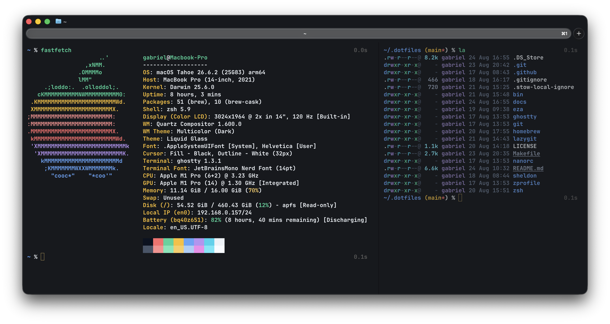
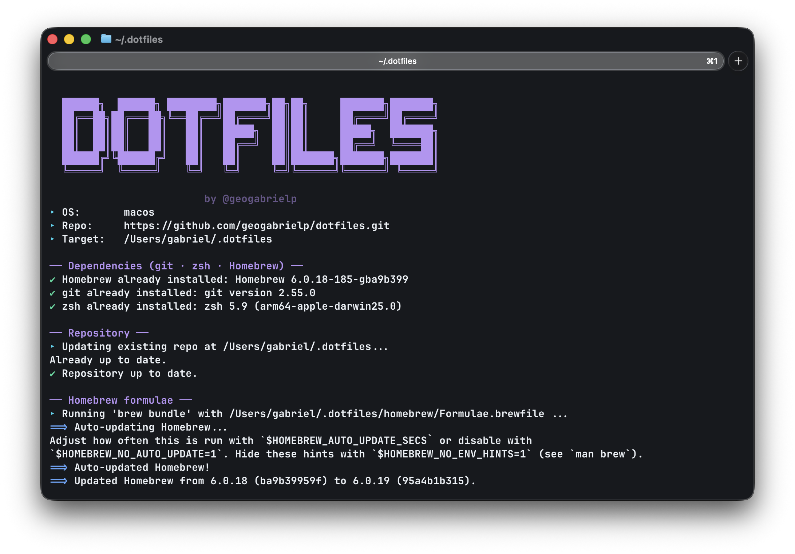

<!-- markdownlint-disable MD033 -->
<!-- markdownlint-disable MD041 -->
<div align="center">

  <!-- Badges status -->
  [](https://github.com/geogabrielp/dotfiles/actions)
  [](https://github.com/geogabrielp/dotfiles/blob/main/LICENSE)
  
  

  <!-- Wide banner -->
  

  <br>

</div>

My **personal dotfiles**, managed with **GNU Stow + Git**: clean, fast and
versioned, with the same setup on **macOS** and **Linux/WSL**. Shared publicly
as a reference, *fork it, adapt it, or just steal the ideas.*

> ⚠️ **Use at your own risk.** These are *my personal configurations*, tailored
> to *my* workflow and machines. They may not suit yours. Review every file
> before applying anything, **do not install blindly**. Your machine, your
> responsibility.

---

## 📸 Preview



---

## 🤔 Why Git + Stow?

Your shell config is one of the longest-lived projects you'll ever work on.
Versioning it with Git gives you **backup, history, rollback, and the ability to
reproduce your entire environment on a new machine in minutes.**

- **Git**: the single source of truth. Every change is tracked, reviewable and
  revertible. No more lost configs or "works on my machine".
- **GNU Stow**: a tiny, idempotent symlink manager. Each tool lives in its own
  folder mirroring `$HOME`, and `stow <tool>` links it into place. Files stay in
  one place (the repo) while behaving as normal dotfiles in `~`.

```bash
~/.dotfiles/
└── zsh/
    └── .zshrc                       # the real, versioned file

$ cd ~/.dotfiles && stow zsh

~/.zshrc → ~/.dotfiles/zsh/.zshrc    # symlink created for you
```

**Why not the alternatives?**

| Approach | Drawback |
| --- | --- |
| `git` in `$HOME` | `git clean` can wipe your entire home. Never. |
| Bare repo + `config` alias | Elegant, but needs an alias/function and handles per-machine packages poorly. |
| Manual `ln -s` scripts | Not idempotent, error-prone. |
| `rcm` / `homesick` / `vcsh` | Heavy external deps for what Stow does in one command. |

🏁 **Key wins:** symlinks not copies · one command per tool · idempotent · mirrors
subfolders (e.g. `~/.config/ghostty`) · zero runtime dependencies.

---

## 🧰 Prerequisites

- **`git`** ([git-scm.com](https://git-scm.com/)): clone and version your dotfiles.
- **`stow`** ([GNU Stow](https://www.gnu.org/software/stow/)): the symlink manager.
- **`make`** ([GNU Make](https://www.gnu.org/software/make/)): for the `Makefile` shortcuts (optional but recommended).
- **Homebrew** ([brew.sh](https://brew.sh/)) (macOS) or **Linuxbrew** ([Homebrew on Linux](https://docs.brew.sh/Homebrew-on-Linux)) (Linux/WSL): recommended for the
  `Brewfile` and one-shot bootstrap.
- **Sheldon** ([sheldon CLI](https://sheldon.cli.rs/Installation.html)): declarative zsh plugin manager (`brew install sheldon`).

> 💡 [`bin/bootstrap.sh`](bin/bootstrap.sh) installs all of this automatically — **none of it is strictly manual**.

---

## 🚀 From-scratch setup

### macOS

```bash
# 1. Xcode Command Line Tools (git, make, compilers, ...)
xcode-select --install

# 2. Homebrew
/bin/bash -c "$(curl -fsSL https://raw.githubusercontent.com/Homebrew/install/HEAD/install.sh)"

# 3. Clone + install (HTTPS by default — no SSH key needed)
git clone https://github.com/geogabrielp/dotfiles.git ~/.dotfiles
cd ~/.dotfiles && make install

# 4. Install CLI tools from the Formulae.brewfile (required)
brew bundle --file ~/Formulae.brewfile

#    Optional — GUI apps (casks):
brew bundle --file=~/Casks.brewfile
```

### Linux / WSL

```bash
# 1. Build essentials + git + stow (Ubuntu/Debian — adapt to your distro)
sudo apt update
sudo apt install -y build-essential git stow

# 2. Clone + install (HTTPS by default)
git clone https://github.com/geogabrielp/dotfiles.git ~/.dotfiles
cd ~/.dotfiles && make install
```

> On Linux, skip the casks: they live in the separate `~/Casks.brewfile` (macOS-only),
> so `brew bundle --file ~/Formulae.brewfile` installs only CLI tools. If `make` isn't
> available, `stow -t ~ */` from the repo root does the same.

### One-shot bootstrap (both platforms)

Installs all dependencies, clones the repo and links every package. It's **idempotent**, safe to re-run anytime:

```bash
curl -fsSL https://raw.githubusercontent.com/geogabrielp/dotfiles/main/bin/bootstrap.sh | bash
```



> ⚠️ Piping to `bash` runs the script **as-is** in your shell. Read
> [`bin/bootstrap.sh`](bin/bootstrap.sh) first — it installs packages and
> writes files into your `$HOME`.

### ✅ Verify

```bash
ls -la ~/.zshrc ~/.gitconfig
# lrwxr-xr-x ... ~/.zshrc -> ~/.dotfiles/zsh/.zshrc
```

> **Already have configs?** See `make adopt`.

### 🍎 macOS system defaults (Finder, Dock, Trackpad, ...)

Applies my preferred macOS defaults, safe to re-run anytime:

```bash
make macos
```

Configures:

- **Finder** (hidden files, extensions, path/status bar, folders on
top)
- **Dock** (autohide, no recents, etc.), tap-to-click, fast key
repeat, screenshot location/format, and expanded save/print panels.

> Lives in [`macos/bin/set-defaults.sh`](macos/bin/set-defaults.sh),
> **not a stow package**. Edit it to tweak. macOS only, no-op on Linux/WSL.

---

## 📦 What's included

| Package | Links into `$HOME` | Purpose |
| --- | --- | --- |
| `zsh/` | `~/.zshrc`, `~/.zshrc.d/` | Modular zsh: env, options, plugins, prompt, aliases |
| `git/` | `~/.gitconfig`, `~/.gitignore_global` | Git config, aliases, HTTPS by default, global ignores |
| `sheldon/` | `~/.config/sheldon/` | zsh plugins: autosuggestions, completions, syntax-highlighting |
| `homebrew/` | `~/Formulae.brewfile`, `~/Casks.brewfile` | Homebrew: formulae/CLI (required) + casks (optional) |
| `ghostty/` | `~/.config/ghostty/` | Ghostty terminal config + theme |
| `eza/` | `~/.config/eza/` | eza (`ls` replacement) + theme |
| `lazygit/` | `~/.config/lazygit/` | lazygit terminal UI config |
| `zprofile/` | `~/.zprofile` | Login-time env (cross-platform Homebrew shellenv) |
| `nanorc/` | `~/.nanorc` | Nano editor config + syntax highlighting |

**Rule of thumb:** the path of a file inside a package mirrors its path relative
to `$HOME`.

---

## 📚 Docs

More detail lives in `docs/` to keep this README short:

- [`docs/quick-reference.md`](docs/quick-reference.md): my personal quick reference for zsh, Git/GitHub, Homebrew, Makefile, Stow, `*_local`, tips.

---

## ⚖️ License

[MIT](LICENSE)

---

<div align="center">

🛠️ Built with **GNU Stow + Git**, inspired by [How I manage my dotfiles using GNU Stow](https://tamerlan.dev/how-i-manage-my-dotfiles-using-gnu-stow/).
<br>
*"you are your dotfiles"*
</div>
